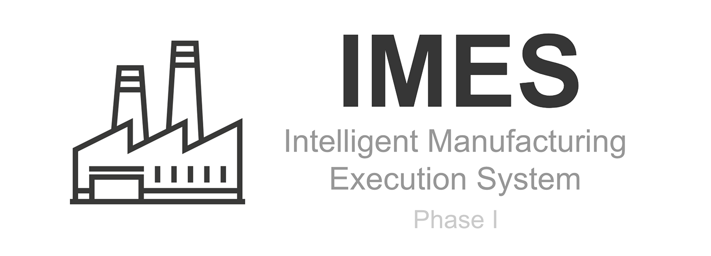

# IMES
IMES is an open source manufacturing execution system application designed for JobShop Manufacturer.

<div align="center">

[](https://travis-ci.org/jukbot/smart-industry)
[](https://ci.appveyor.com/project/jukbot/smart-industry/branch/master)
[](https://www.codacy.com/app/jukbot/smart-industry?utm_source=github.com&amp;utm_medium=referral&amp;utm_content=jukbot/smart-industry&amp;utm_campaign=Badge_Grade)
[](https://gitter.im/imes-project/Lobby?utm_source=share-link&utm_medium=link&utm_campaign=share-link)
[](https://github.com/jukbot/smart-industry/)
[](https://github.com/jukbot/smart-industry/)
[](https://opensource.org/licenses/Apache-2.0)

</div>

## Annoucement
> Currently, we've temporary paused the project due to discussing with an engineer team for the next phase in road map.
 
## Demo

[Login here](https://smart-mes.firebaseapp.com/) 
 
| E-mail | Password | 
|---------|---------------|
| demo@imes.in.th | demouser |  

Note: If you found any bugs please report me or open an issue, thanks 😊

## Contribution

Please know that this project is still in development with a lot of bugs, if you want to contribute us (help me) working on this project please read [About Project document](https://github.com/jukbot/smart-industry/blob/master/About%20Project.pdf) for an overview and scope of this project phase I and for the technical information please read [Technical document](https://goo.gl/JNmrPE) to understand how this application will work.

Wanna join chat with us just join this [Gitter room](https://gitter.im/imes-project/Lobby?utm_source=share-link&utm_medium=link&utm_campaign=share-link) 


## About IMES Project

A manufacturing execution system (MES) involves using computers to track and record the entire manufacturing process from extracting raw materials to producing finished products. They mainly function as stand-alone systems that primarily collect data about the workplace. A MES can be used in a wide variety of industries including packing goods, metal or plastic production, and automation.  The main purpose for using a MES is to improve production, minimize delays, and make delivery of goods easier.

A “Intelligent” MES builds on top of the original idea of MES by using mathematical algorithms that allow decision making. Henceforth, the information system will be able to select the most suitable solution in a problem scenario. By employing a intelligent MES system with improved decision making, it can further enhance the performance of manufacturing and drive down production costs.


While a majority Country of the world are still utilizes Industry 2.0, it still lacks the support for manufacturing systems that can reduce errors in the workflow and allow businesses to work smarter. The problem can be seen when small to medium businesses are not able to invest in high-technology systems or hire adequate personnel to manage production, they will be stuck with the current standards. This is known as the Industry 2.0 “trap”. It is one of the driving forces that this project was put forth. Smart MES technology can provide an affordable solution to factory owners and advance the standards for industry into the future. 

This project, involves building a Smart MES web application that will help manufacturers plan the manufacturing process, simulate the workflow of the planned process, track the events of the actual production line and finally generate a report  of the actual process. This will help manufacturers build a more effective production line as well as reduce and prevent potential problems that can occur throughout the manufacturing process. Chapter 2 will cover the feasibility study for the Smart MES project.


### Project Objective

- Help workers calculate and select the most suitable job priority for managing process scheduling.
- Increase the degree of automation and digitization of production, manufacturing and industrial processes.
- Improve efficiency in the production and planning processes by managing the entire value chain process.
- Visualize the workflow and the status of jobs by simulating a building block diagram.


### Implementation Techniques
According to the scope, this project uses an Internet connection to connect to an online web-based application. Our implementation will attempt to work using the Javascript language which is cross platform, flexible and able to work on mobile devices. 


In particular, the following processes and algorithms will be used in this project: linear programming (LP), Statistical Process Control (SPC), Overall Equipment Effectiveness (OEE) and production scheduling algorithms which include Earliest Due Date (EDD) and Shortest Processing Time (SPT).

``Resource Usage Optimization using Linear Programming (LP)``
Linear programming (LP) is used for resource optimization, as long as the output function is linear.  This helps in cases where there are feasible solutions, or better yet, optimal solutions. However, if specific algorithms are required, the correlation values of the outcome may be weak. LP can only solve convex problems directly.

``Overall Equipment Effectiveness (OEE)``
Overall Equipment Effectiveness (OEE) is a tool used to measure manufacturing performance. In general, there are a lot of data and a large number of measurement methods that are outdated and cannot be used to improve productivity. Sometimes there are too many criteria that are unrelated to each other and an inconsistency of fragmented data. Thus, OEE is an ideal way to measure the quality standard of manufacturing apart from knowing the machine’s performance. It can provide information about the cause of performance loss and can suggest ways to decrease that loss accurately and systematically. 

There are three major components in calculating OEE. First, the availability that measures the total amount of time that the system is running along with undesired downtime. Second, performance that measures the number of units produced in a time cycle. A perfect performance rating would mean that the system is running as fast as possible. Third, quality of the manufacturing system is measured. Quality involves measuring the number of faulty parts in production. A system with 100% quality means that there is no defective parts being produced.

``Original quantity (Q0)``
Original quantity is the quantity of an order that includes the backup order items. A damaged item can  be replaced the with a backup when unexpected events occur.

``Scheduling Algorithms``
Scheduling optimization involves selecting the appropriate scheduling method by considering the resources and time available. By implementing the decision making model which analyzes the current job in the system, it rearranges the job priorities to meet the condition and get the best outcome. There are two production scheduling algorithms that will be used in this project. The first is EDD which takes into account the due date of the product and sorts the earliest items first. The second algorithm is SPT which considers the time to process the product. The products with the fastest processing time will take priority. 


## Browser Supported

<center>

| [](http://caniuse.com/#feat=fetch)</br>Edge | [](http://caniuse.com/#feat=fetch)</br>Firefox | [](http://caniuse.com/#feat=fetch)</br>Chrome | [](http://caniuse.com/#feat=fetch)</br>Safari | [](http://caniuse.com/#feat=fetch)</br>Opera | 
| ---------: | ---------: | ---------: | ---------: | ---------:
| 17+ | 44+ | 46+ | 11.1+ | 33+

</center>

Reference: https://caniuse.com/#search=web%20component


## About Polymer Project


This template is a starting point for building apps using a drawer-based
layout. The layout is provided by `app-layout` elements.

This template, along with the `polymer-cli` toolchain, also demonstrates use
of the "PRPL pattern" This pattern allows fast first delivery and interaction with
the content at the initial route requested by the user, along with fast subsequent
navigation by pre-caching the remaining components required by the app and
progressively loading them on-demand as the user navigates through the app.

The PRPL pattern, in a nutshell:

* **Push** components required for the initial route
* **Render** initial route ASAP
* **Pre-cache** components for remaining routes
* **Lazy-load** and progressively upgrade next routes on-demand


### Setup Project

##### Prerequisites

Install latest NodeJS (required version >= 8.x)

Download: https://nodejs.org/en

Install latest [npm](https://www.npmjs.com) (required version >= 5.x)

```bash
    $ npm i npm -g
```

Install [Yarn](https://yarnpkg.com/en/) (required version >= 1.6.0)

```bash
    $ npm install -g yarn
```

Install [polymer-cli](https://github.com/Polymer/polymer-cli): (require version >= 1.6.x)

```bash
    $ yarn add global polymer-cli
```

`Note: polymer-cli is not able to install with npm version 5.x.x for now. Please use yarn to install.`

Install [bower](https://bower.io/) (require version >= 1.8.x)

```bash
    $ yarn add global bower
```

### Install dependency packages

```bash
    $ npm install
    $ bower install
```

### Start the development

This command serves the app at `http://localhost:8081` and provides basic URL
routing for the app:

```bash
    $ polymer serve --open
```

### Start the production server (PRPL Server)

This command serves the app at `http://localhost:8081` and provides basic URL
routing for the app:

```bash
    $ polymer build
    $ npm start
```

### Build Project

This command performs HTML, CSS, and JS minification on the application dependencies, and generates a service-worker.js file with code to pre-cache the dependencies based on the entrypoint and fragments specified in `polymer.json`.

The output files are in `build/default` which suitable for serving from a HTTP/2+Push compatible server.

Build the project: 
```bash
    $ polymer build
```

### Preview the build

This command serves the production version of the app at `http://localhost:8080`generated using fragment bundling:

```bash
    $ polymer serve build/es6-unbundled/ --open
```

### Run Lint

This command will run
[Polymer Lint](https://github.com/Polymer/polymer-cli) 

```bash
    $ polymer lint --input src/**/*.html
```

### Run Tests (Unit Test)

This command will run
[Web Component Tester](https://github.com/Polymer/web-component-tester) against the
browsers currently installed on your machine.

```bash
    $ polymer test
```

### Deploy Project

Polymer 2.x/3.x brought the standards-compliant ES6 class-based syntax for defining Web Components. This works well for most modern browsers and ES6 has a lot of other nice features (like arrow functions) to make your JS code cleaner and more fun to write.

But if you need to support older browsers like IE 11 you will have to compile your code to ES5 which comes with performance drawbacks for modern browsers compared to running ES6 on them directly.

The ideal approach is to use differential serving to serve the ES6 version to modern browsers and a fallback ES5 version to older browser. prpl-server-node is a sample implementation of a Node server that uses this pattern. I took the ideas from this implementation and created a sample based on the polymer-starter-kit on how you can use differential serving on Firebase Hosting using Cloud Functions for Firebase for dynamically sending the right version to the user.

#### Method 1: Deploy on Firebase Hosting (as static site)

After, run polymer build then run this to deploy applicaiton
(make sure you have login and selected your firebase project)
```bash
    $ firebase deploy
```

#### Method 2: Deploy on PRPL server (reverse proxy with nginx)

`PRPL pattern` defines how a production-ready Polymer app works efficiently by sending only the required resources to the client-side:

* `Push` - critical resources for the initial route.
* `Render` - initial route.
* `Pre-cache` - remaining routes.
* `Lazy-load` - create remaining routes on demand.


In PRPL pattern, the server needs to be able to identify the resources required by each of the app’s routes. Instead of bundling the resources into a single unit for download, it uses HTTP2 push to deliver the individual resources needed to render the requested route. 

When building an app, always consider to prioritize sending the critical resources to render a meaningful view first, and later send the rest of your app resources as per the request. 


Coming back to our topic, in PRPL pattern, the server and service worker together work to precache the resources for the inactive routes.

When the user switches routes, the app lazy-loads any required resources that haven’t been cached yet, and creates the required views.

`prpl-server` is smart enough to use the user-agent header, detect browser capabilities, and serve the right build for your browser 


First, let install PRPL server on your local server
```bash
   $ yarn global add prpl-server
```

Then, go to project directory

To run PRPL server in development
```bash
   $ prpl-server --root ./build --config polymer.json --host 127.0.0.1
```

To run PRPL server in production
```bash
   $ prpl-server --root ./build --config polymer.json --host 127.0.0.1 --https-redirect
```

In order to serve app with nginx reverse proxy (http2 supportted) you need to have your certificate. We suggest certbot tool to help generate site certificate.

`Example of nginx configuration files`
```nginx
server {

    listen 443      ssl http2; 
    listen [::]:443 ssl http2;
    server_name     <yourdomainname>;

    if ($scheme != "https") {
        return 301 https://$host$request_uri;
    }  

    root            /var/www/html;
    index           index.html;
    charset         utf-8;
    access_log      off;
    error_log       /var/log/nginx.error_log error;

    # SSL Certificate config
    ssl_certificate /etc/letsencrypt/live/<yourdomainname>/fullchain.pem; 
    ssl_certificate_key /etc/letsencrypt/live/<yourdomainname>/privkey.pem;
    include /etc/letsencrypt/options-ssl-nginx.conf; 
    
    ssl_session_timeout 10m;
    ssl_session_cache shared:SSL:10m;
    ssl_session_tickets off;

    # Diffie-Hellman parameter for DHE ciphersuites, recommended 4096 bits
    # to generate your dhparam.pem file, run $ openssl dhparam -out /etc/letsencrypt/live/<yourdomainname>/dhparam.pem 4096
    ssl_dhparam  /etc/letsencrypt/live/<yourdomainname>/dhparam.pem;

    # SSL Key exchanges
    ssl_protocols TLSv1.2 TLSv1.3; #!! TLS 1.3 Requires nginx >= 1.13.0 !!
    ssl_ecdh_curve secp384r1;
    ssl_ciphers 'ECDHE-ECDSA-AES256-GCM-SHA384:ECDHE-RSA-AES256-GCM-SHA384:ECDHE-ECDSA-CHACHA20-POLY1305:ECDHE-RSA-CHACHA20-POLY1305:ECDHE-ECDSA-AES128-GCM-SHA256:ECDHE-RSA-AES128-GCM-SHA256:ECDHE-ECDSA-AES256-SHA384:ECDHE-RSA-AES256-SHA384:ECDHE-ECDSA-AES128-SHA256:ECDHE-RSA-AES128-SHA256';
    ssl_prefer_server_ciphers on;

    # OCSP Stapling - fetch OCSP records from URL in ssl_certificate and cache them for faster handshake
    ssl_stapling on;
    ssl_stapling_verify on;
    ssl_trusted_certificate /etc/letsencrypt/live/<yourdomainname>/fullchain.pem;
    
    # DNS for OSCP Resolver - to lookup your upstream domain name URL
    resolver 8.8.8.8 4.4.4.4 valid=300s ipv6=off;
    resolver_timeout 10s;

    # Security Header
    add_header Strict-Transport-Security "max-age=31536000; includeSubdomains; preload";
    add_header Referrer-Policy no-referrer-when-downgrade;
    add_header X-Content-Type-Options nosniff;
    add_header X-Frame-Options SAMEORIGIN;
    add_header X-XSS-Protection "1; mode=block";
    add_header Content-Security-Policy upgrade-insecure-requests;

    # Required for LE certificate enrollment using certbot
    location '/.well-known/acme-challenge' {
	    default_type "text/plain";
	    root /var/www/html;
    }
    location / {
	    root /var/www/html;
    }

    # Reverse proxy
    location / {
        http2_push_preload on;
        proxy_pass http://127.0.0.1:8080/;
        proxy_set_header X-Forwarded-Proto $scheme;
#       proxy_http_version 1.1;
        proxy_set_header Upgrade $http_upgrade;
        proxy_set_header Connection "upgrade";
        proxy_set_header X-Forwarded-For $proxy_add_x_forwarded_for;
        proxy_set_header X-Forwarded-Host $host:$server_port;
        proxy_set_header X-Forwarded-Server $host;
        proxy_read_timeout 3m;
        proxy_send_timeout 3m;
        proxy_buffer_size  128k;
        proxy_buffers   32 32k;
        proxy_busy_buffers_size 128k;
    }
}
```

Learn about lets encrypt certificate at https://letsencrypt.org/certificates/
Learn about nginx config at https://github.com/jukbot/setup-nginx-webserver
Learn about PRPL server config at https://github.com/Polymer/prpl-server-node


## Contribution

If you found an error or bug in this project, please open an issue at: https://github.com/jukbot/smart-industry/issues

Patches are encouraged, and may be submitted by forking this project and submitting a pull request through GitHub.

Pull requests and feedback are always welcome. We are alway do our best to process them as fast as possible. 

## References

- https://medium.com/platform-engineer/polymer-2-0-building-progressive-web-apps-with-enhanced-web-platform-features-933251824f13
- https://www.nginx.com/blog/nginx-1-13-9-http2-server-push/#automatic-push


## License

Copyright 2016-2018 Chukkrit Visitsaktavorn.

Licensed under the Apache License, Version 2.0 (the "License"); you may not use this file except in compliance with the License. You may obtain a copy of the License at

(https://www.apache.org/licenses/LICENSE-2.0)

Unless required by applicable law or agreed to in writing, software distributed under the License is distributed on an "AS IS" BASIS, WITHOUT WARRANTIES OR CONDITIONS OF ANY KIND, either express or implied. See the License for the specific language governing permissions and limitations under the License.
